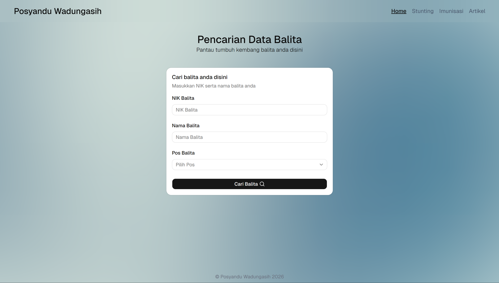
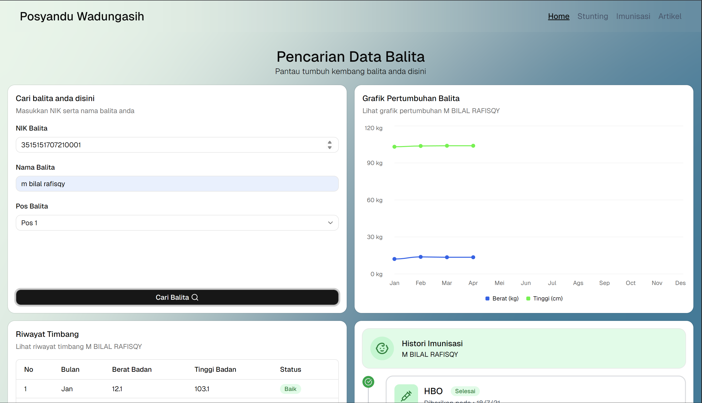

# 🩺 Posyandu Monitoring System

A village-level toddler health monitoring platform that utilizes the Google Sheets API as a serverless database.




Or, you can preview the web [here](https://posyandu-wadungasih.vercel.app/)

## Overview

This monitoring website was created to address the need for transparent, independently accessible child health data. The platform aims to eliminate parents' reliance on manual checks by providing a digital dashboard that displays immunization history and toddler development in real-time and accurately. This system enables rapid data synchronization between staff records and parents' dashboards, providing a lightweight yet robust data management solution.

## Key Features

- Real-time Monitoring with Google Sheets
- Tracking Immunization History and Toddler Stunting Data
- Visualizing Toddler Weight and Height Using Charts

## Tech Stack

- [React v19](https://react.dev/learn/installation) for Frontend
- [Google Sheet API](https://console.cloud.google.com/) for Backend
- [Tailwind CSS](https://tailwindcss.com/) and [shadcn](https://ui.shadcn.com/) for the UI
- [Vercel](https://vercel.com) for deployment

## How to run this

Firstly, clone this repo

```bash
git clone https://github.com/adyatmaa/posyandu-monitoring.git
```

Then, install the dependencies and run the code with

```bash
npm install
npm run dev
```

After the installation complete, you need to setup your Google Sheet API and API KEY. Refer to ` .env.example` for the required variables.

```env
VITE_GOOGLE_APP_CREDENTIALS = you can leave this empty
VITE_SHEET_ID = you can find this on your spreadsheet URL
VITE_API_KEY = you can get this by generate it from your Google Cloud Console
```

All set, you can run this code locally in your computer👌
